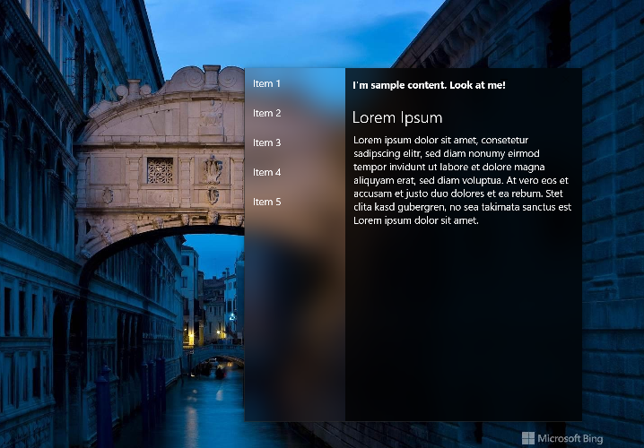
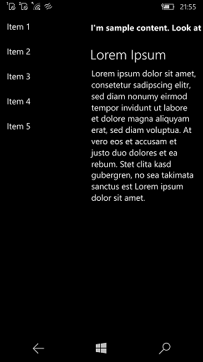

# AcrylicControls

Experiment / PoC / Design for old UWP

## Screenshots

## How to achieve an acrylic background effect in old UWP-application

This project is a simple example of how to utilize the acrylic accent brush. 
The example code is based on this [post](https://stackoverflow.com/a/43711413/6649611).

## Tech. details

- Req. Win. os. build: 15063 or above
- Min. Win. os. build: 14393

## TODO
Solve the mystery of No acrylic at W10M... :)

## References

- https://stackoverflow.com/a/43711413/6649611
- https://medium.com/microsoft-design/digital-design-is-never-done-ca50836a8c8a
- https://github.com/DinoChan/Fluent-Design-System-Sample

## ..

## .
[m][e] 2022
